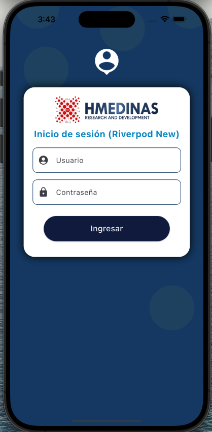
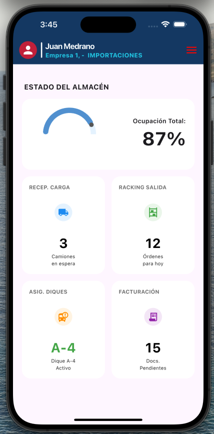
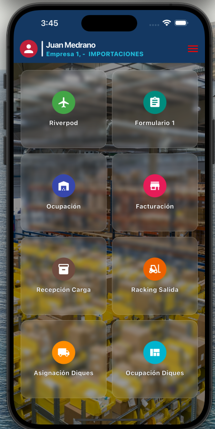
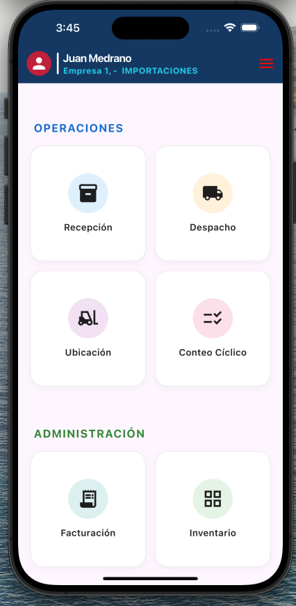
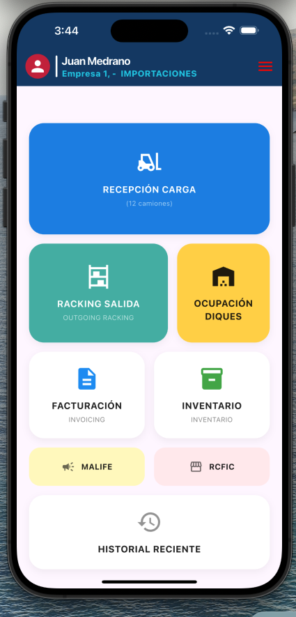
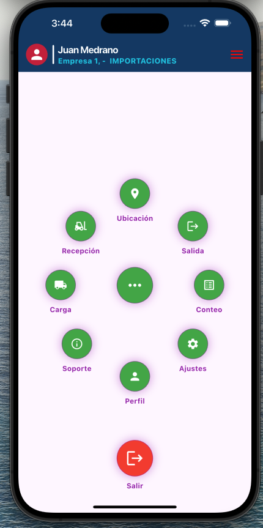
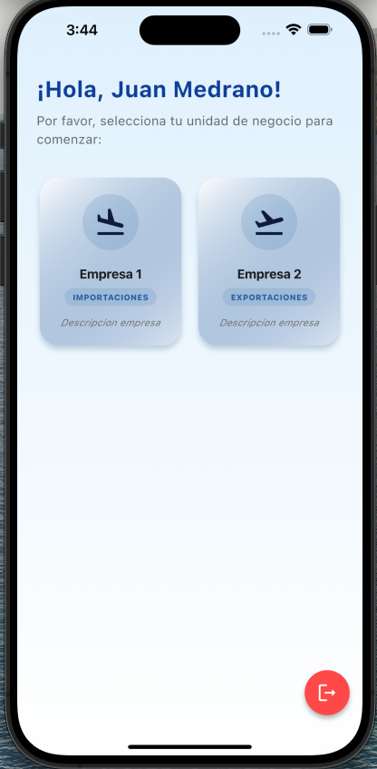
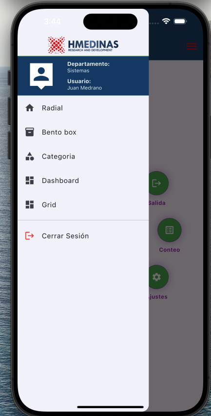

# Base Flutter

Un proyecto Flutter estructurado con Clean Architecture para facilitar el desarrollo escalable y mantenible.

## 📋 Tabla de Contenidos

- [Arquitectura del Proyecto](#arquitectura-del-proyecto)
- [Estructura Detallada](#estructura-detallada)
- [Capas de Clean Architecture](#capas-de-clean-architecture)
- [Features Implementados](#features-implementados)
- [Guía de Desarrollo](#guía-de-desarrollo)
- [Instalación](#instalación)
- [Convenciones de Código](#convenciones-de-código)

## 🏗️ Arquitectura del Proyecto

Este proyecto sigue los principios de **Clean Architecture** organizando el código en capas claramente definidas con separación de responsabilidades. La arquitectura está diseñada para ser escalable, mantenible y fácil de testear.

## 📂 Estructura Detallada

```
lib/
├── core/                                    # Funcionalidad compartida en toda la aplicación
│   ├── api/                                 # Servicios base para comunicación con APIs
│   │   ├── base_api_service.dart           # Servicio base con Dio
│   │   └── api_client.dart                 # Cliente HTTP configurado
│   │
│   ├── config/                              # Configuraciones de la aplicación
│   │   ├── app_config.dart                 # Configuración global de la app
│   │   └── config_reader.dart              # Lector de archivos de configuración
│   │
│   ├── constants/                           # Constantes globales
│   │   ├── app_constants.dart              # Constantes de la aplicación
│   │   └── app_end_point.dart              # URLs y endpoints de API
│   │
│   ├── common/                              # Recursos comunes compartidos
│   │   ├── domain/
│   │   │   └── entities/                   # Entidades compartidas entre features
│   │   │       ├── user_models.dart        # Modelo de usuario
│   │   │       ├── business_models.dart    # Modelo de negocio
│   │   │       ├── response_api_models.dart # Respuestas API estándar
│   │   │       └── transaction_api_models.dart # Modelos de transacciones
│   │   └── provider/                       # Providers globales
│   │       ├── app_state_provider.dart     # Estado global de la app
│   │       └── session_provider.dart       # Gestión de sesión de usuario
│   │
│   ├── errors/                              # Manejo de errores y excepciones
│   ├── extensions/                          # Extensiones de Dart/Flutter
│   ├── helpers/                             # Funciones auxiliares
│   │
│   ├── router/                              # Configuración de rutas/navegación
│   │   └── app_router.dart                 # Definición de rutas de la app
│   │
│   ├── mock/                                # Datos mock para desarrollo
│   │   └── routes_mock.dart                # Rutas y datos simulados
│   │
│   ├── theme/                               # Temas y estilos
│   │   └── app_theme.dart                  # Tema personalizado de la app
│   │
│   ├── ui/                                  # UI compartida
│   │   └── widgets/                        # Widgets reutilizables globales
│   │       ├── app_bar_widget.dart         # AppBar personalizado
│   │       ├── drawer_widget.dart          # Drawer de navegación
│   │       ├── business_card_widget.dart   # Tarjeta de negocio
│   │       └── logout_button_widget.dart   # Botón de cerrar sesión
│   │
│   └── utils/                               # Utilidades generales
│       ├── console.dart                    # Utilidades de consola/debug
│       ├── alerts.dart                     # Sistema de alertas
│       └── text_helpers.dart               # Helpers para texto
│
├── features/                                # Módulos de funcionalidad (por feature)
│   │
│   ├── auth/                                # 🔐 Feature de autenticación
│   │   ├── data/                           # Capa de datos
│   │   │   ├── sources/                    # Fuentes de datos
│   │   │   │   └── auth_api.dart          # API de autenticación
│   │   │   ├── models/                     # DTOs y modelos
│   │   │   │   ├── login_response_model.dart
│   │   │   │   └── auth_state.dart        # Estados de autenticación
│   │   │   └── repositories/               # Implementación de repositorios
│   │   │
│   │   ├── domain/                         # Capa de dominio (lógica de negocio)
│   │   │   ├── entities/                   # Entidades del negocio
│   │   │   ├── repositories/               # Interfaces de repositorios
│   │   │   └── usecases/                   # Casos de uso
│   │   │
│   │   └── presentation/                   # Capa de presentación (UI)
│   │       ├── screens/                    # Pantallas
│   │       │   ├── login_provider_screen.dart
│   │       │   ├── login_riverpod_screen.dart
│   │       │   └── login_riverpod_new_screen.dart
│   │       ├── provider/                   # Gestión de estado
│   │       │   ├── auth_provider.dart      # Provider (ChangeNotifier)
│   │       │   ├── auth_riverpod.dart      # Riverpod StateNotifier
│   │       │   └── auth_riverpod_new.dart  # Riverpod AsyncNotifier
│   │       └── widgets/                    # Widgets específicos
│   │           ├── login_background_widget.dart
│   │           └── card_container_widget.dart
│   │
│   ├── home/                                # 🏠 Feature de pantalla principal
│   │   ├── data/                           # Capa de datos
│   │   ├── presentation/
│   │       ├── screens/                    # Múltiples diseños de home
│   │       │   ├── home_dashboard_screen.dart
│   │       │   ├── home_grid_screen.dart
│   │       │   ├── home_categori_screen.dart
│   │       │   ├── home_bento_box_screen.dart
│   │       │   ├── home_radial_screen.dart
│   │       │   ├── selection_business_grid_screen.dart
│   │       │   └── selection_bussiness_screen.dart
│   │       ├── provider/                   # Gestión de estado
│   │       └── widgets/                    # Widgets específicos
│   │
│   ├── initialization/                      # 🚀 Feature de inicialización
│   │   └── presentation/
│   │       ├── screens/
│   │       │   └── splash_screen.dart      # Pantalla de splash
│   │       └── provider/
│   │           └── splash_provider.dart    # Lógica de inicialización
│   │
│   ├── error_page/                          # ⚠️ Feature de páginas de error
│   │   └── presentation/
│   │       ├── screens/
│   │       │   ├── error_screen.dart       # Pantalla de error genérico
│   │       │   ├── not_found_screen.dart   # Error 404
│   │       │   └── unauthorized_screen.dart # Error 401
│   │       └── provider/
│   │
│   └── common/                              # Recursos comunes entre features
│       ├── data/                           # Modelos compartidos
│       ├── domain/                         # Lógica compartida
│       └── presentation/                   # UI compartida
│           ├── screens/
│           └── provider/
│
├── assets/                                  # Recursos estáticos
│   ├── config/                             # Archivos de configuración
│   ├── images/                             # Imágenes e íconos
│   └── mocks/                              # Datos JSON mock
│       ├── auth/                           # Mocks de autenticación
│       └── user/                           # Mocks de usuarios
│
└── main.dart                                # Punto de entrada de la aplicación
```

## 🏛️ Capas de Clean Architecture

Este proyecto implementa Clean Architecture con tres capas principales más una capa transversal:

### 1. **Domain Layer (Capa de Dominio)** 🎯
- **Ubicación**: `features/[feature]/domain/`
- **Responsabilidad**: Lógica de negocio pura, independiente de frameworks y tecnologías externas
- **Contiene**:
  - `entities/`: Objetos de negocio (clases POJO/modelos inmutables)
  - `repositories/`: Interfaces (contratos) de repositorios - define QUÉ hacer, no CÓMO
  - `usecases/`: Casos de uso (acciones específicas del negocio) - orquesta la lógica
- **Ejemplo**: `UserEntity`, `AuthRepository` (interface), `LoginUseCase`
- **Reglas**: NO debe depender de ninguna otra capa, es el corazón de la aplicación

### 2. **Data Layer (Capa de Datos)** 💾
- **Ubicación**: `features/[feature]/data/`
- **Responsabilidad**: Gestión de datos y comunicación con servicios externos
- **Contiene**:
  - `sources/`: Implementaciones de fuentes de datos (API REST, GraphQL, BD local, cache)
  - `models/`: DTOs (Data Transfer Objects) que convierten JSON/datos externos a entidades
  - `repositories/`: Implementaciones concretas de las interfaces del dominio
- **Ejemplo**: `AuthApi`, `LoginResponseModel`, `AuthRepositoryImpl`
- **Reglas**: Depende de Domain, implementa sus contratos, maneja serialización/deserialización

### 3. **Presentation Layer (Capa de Presentación)** 🎨
- **Ubicación**: `features/[feature]/presentation/`
- **Responsabilidad**: UI y gestión de estado - todo lo que el usuario ve e interactúa
- **Contiene**:
  - `screens/`: Pantallas completas (pages)
  - `provider/`: Gestores de estado (Provider, Riverpod, Bloc, Cubit, etc.)
  - `widgets/`: Componentes UI reutilizables específicos del feature
- **Ejemplo**: `LoginScreen`, `AuthProvider`, `LoginBackgroundWidget`
- **Reglas**: Depende de Domain (usa casos de uso), NO debe depender de Data directamente

### 4. **Core (Capa Transversal)** ⚙️
- **Ubicación**: `core/`
- **Responsabilidad**: Funcionalidad compartida entre todos los features
- **Contiene**:
  - `api/`: Cliente HTTP base (Dio configurado con interceptores)
  - `config/`: Configuraciones globales (entornos, feature flags)
  - `constants/`: Constantes y endpoints
  - `common/`: Entidades y providers compartidos
  - `theme/`: Temas y estilos de la aplicación
  - `ui/widgets/`: Widgets reutilizables globales
  - `utils/`: Utilidades (formateo, validación, helpers)
  - `router/`: Sistema de navegación
  - `mock/`: Datos de prueba
- **Reglas**: Puede ser usado por cualquier feature, debe ser genérico y reutilizable

## 📊 Flujo de Datos

```
┌─────────────────────────────────────────────────────────────┐
│                      PRESENTATION LAYER                     │
│  ┌─────────────┐    ┌──────────────┐    ┌──────────────┐    │
│  │   Screen    │───▶│   Provider   │───▶│   UseCase    │    │
│  │   (UI)      │◀───│  (State Mgmt)│◀───│  (Domain)    │    │
│  └─────────────┘    └──────────────┘    └──────────────┘    │
└────────────────────────────────┬────────────────────────────┘
                                 │
                                 ▼
┌─────────────────────────────────────────────────────────────┐
│                        DOMAIN LAYER                         │
│  ┌──────────────┐    ┌─────────────────────────────────┐    │
│  │   UseCase    │───▶│  Repository (Interface)         │    │
│  │              │◀───│                                 │    │
│  └──────────────┘    └─────────────────────────────────┘    │
└────────────────────────────────┬────────────────────────────┘
                                 │
                                 ▼
┌─────────────────────────────────────────────────────────────┐
│                         DATA LAYER                          │
│  ┌──────────────────┐    ┌───────────┐    ┌────────────┐    │
│  │  Repository Impl │───▶│   Model   │───▶│   Source   │    │
│  │                  │◀───│   (DTO)   │◀───│  (API/DB)  │    │
│  └──────────────────┘    └───────────┘    └────────────┘    │
└─────────────────────────────────────────────────────────────┘
```

## ✨ Features Implementados

Este proyecto incluye varios features completamente funcionales que sirven como referencia:

### 🔐 Authentication (Auth)
Sistema completo de autenticación con múltiples implementaciones de gestión de estado:

- **Screens**:
  - `login_provider_screen.dart` - Login con Provider (ChangeNotifier)
  - `login_riverpod_screen.dart` - Login con Riverpod (StateNotifier)
  - `login_riverpod_new_screen.dart` - Login con Riverpod AsyncNotifier 
  
  <p align="center">
    
  </p>

  
- **State Management**: Tres implementaciones diferentes para comparar enfoques
  - Provider (ChangeNotifier): Más simple, ideal para proyectos pequeños
  - Riverpod (StateNotifier): Más robusto, sin context
  - Riverpod (AsyncNotifier): Para operaciones asíncronas complejas

- **Data Sources**: `auth_api.dart` - Comunicación con API de autenticación
- **Models**: `login_response_model.dart`, `auth_state.dart`
- **Widgets**: Fondo animado, contenedor de tarjeta personalizado

### 🏠 Home
Múltiples diseños de pantalla principal para diferentes necesidades:

- `home_dashboard_screen.dart` - Dashboard con métricas y estadísticas
 <p align="center">
    
  </p>

- `home_grid_screen.dart` - Vista en cuadrícula
 <p align="center">
    
  </p>

- `home_categori_screen.dart` - Vista por categorías
 <p align="center">
    
  </p>

- `home_bento_box_screen.dart` - Diseño Bento Box moderno
 <p align="center">
    
  </p>

- `home_radial_screen.dart` - Visualización radial con Syncfusion Charts
 <p align="center">
    
  </p>

- `selection_business_grid_screen.dart` - Selector de negocios en grid
 <p align="center">
    
  </p>

- `selection_bussiness_screen.dart` - Selector de negocios pero como una lista,lamentablemente no saque imagen de esto jaja.

### 🚀 Initialization
Gestión del flujo de inicialización de la aplicación:

- **Splash Screen**: Pantalla de carga inicial
- **Splash Provider**: Lógica de redirección
  - Verifica si hay sesión activa
  - Redirige a Login o Home según corresponda
  - Carga configuraciones iniciales

### ⚠️ Error Pages
Páginas de error profesionales para diferentes casos:

- `error_screen.dart` - Error genérico 500
- `not_found_screen.dart` - Error 404 (página no encontrada)
- `unauthorized_screen.dart` - Error 401 (no autorizado)

### 🔧 Core Features

#### API Configuration
- `base_api_service.dart` - Servicio base con Dio configurado
- `api_client.dart` - Cliente HTTP con interceptores
- Manejo automático de errores HTTP
- Timeout configurado
- Headers personalizados

#### Theme System
- `app_theme.dart` - Sistema de temas personalizado
- Colores, tipografías y estilos consistentes
- Soporte para tema claro (dark mode configurable)

#### Router
- `app_router.dart` - Sistema de navegación
- Rutas nominadas (named routes)
- Guards de autenticación
- Redirecciones automáticas

#### Global Widgets
- `app_bar_widget.dart` - AppBar consistente
- `drawer_widget.dart` - Menú de navegación lateral
 <p align="center">
    
  </p>
  
- `business_card_widget.dart` - Tarjeta de negocio reutilizable
- `logout_button_widget.dart` - Botón de cerrar sesión

#### Utils & Helpers
- `console.dart` - Logs mejorados para debugging
- `alerts.dart` - Sistema de alertas consistente (usando rflutter_alert)
- `text_helpers.dart` - Funciones auxiliares para texto

#### Session Management
- `session_provider.dart` - Gestión de sesión de usuario
- `app_state_provider.dart` - Estado global de la aplicación
- Persistencia de sesión

#### Mock System
- `routes_mock.dart` - Rutas y datos simulados
- Archivos JSON en `assets/mocks/` para desarrollo sin backend
- Facilita testing y desarrollo offline

## 🎯 Principios de Clean Architecture Aplicados

### ✅ **Separation of Concerns (SoC)**
Cada capa tiene una responsabilidad única y bien definida:
- **Domain**: Reglas de negocio
- **Data**: Manejo de datos
- **Presentation**: UI y experiencia de usuario

### ✅ **Dependency Rule (Regla de Dependencias)**
Las dependencias apuntan hacia adentro (hacia el dominio):
```
Presentation → Domain ← Data
     ↓           ↑        ↓
   Core ←───────┴────────┘
```
- El dominio NO conoce detalles de implementación
- Las capas externas dependen de las internas, NUNCA al revés
- Core es usado por todos pero no depende de features específicos

### ✅ **Dependency Inversion (Inversión de Dependencias)**
- Se usan interfaces/abstracciones en lugar de implementaciones concretas
- Los repositorios se definen como interfaces en Domain
- Las implementaciones están en Data
- Facilita cambiar implementaciones sin afectar la lógica de negocio

### ✅ **Testability (Testeabilidad)**
- Lógica de negocio aislada y 100% testeable
- Inyección de dependencias facilita el testing
- Uso de interfaces permite crear mocks fácilmente
- Separación clara entre lógica y UI

### ✅ **Scalability (Escalabilidad)**
- Estructura modular por features
- Fácil agregar nuevas funcionalidades sin afectar las existentes
- Bajo acoplamiento entre módulos
- Alto cohesión dentro de cada feature

### ✅ **Maintainability (Mantenibilidad)**
- Código organizado y fácil de encontrar
- Convenciones de nomenclatura consistentes
- Separación clara de responsabilidades
- Documentación en el código

## 🚀 Guía de Desarrollo

Si estás empezando un proyecto Flutter desde cero, sigue este orden recomendado (basado en `Read_plan_Dev.md`):

### Fase 1: Estructura y Configuración Base
1. **Crear estructura de carpetas** según lo definido en este README
2. **Definir el Tema** (`core/theme/app_theme.dart`) - Define colores y tipografías desde el inicio
3. **Configurar Router** (`core/router/app_router.dart`) - Define rutas básicas: `/`, `/login`, `/home`

### Fase 2: Infraestructura de Red
4. **BaseApiService con Dio** (`core/api/base_api_service.dart`) - Configura interceptores, timeout, headers
5. **Crear Mocks** (`assets/mocks/`) - Prueba tus modelos sin backend
   - Archivos JSON para respuestas de API
   - MockDataSources para testing

### Fase 3: Desarrollo de Features
6. **Diseño del Login** (UI primero) - Screens y Widgets
7. **Lógica de Auth** - Model → Repository → UseCase → Provider
8. **Splash Screen** - Lógica de redirección (¿Está logueado? → Home : Login)
9. **Páginas de Error** - 404, 500, 401

### Orden de Ejecución Recomendado

| Orden | Tarea Crítica | Ubicación Clave |
|-------|---------------|-----------------|
| 1 | Estructura de carpetas | `lib/features/`, `lib/core/` |
| 2 | Tema Global (Colores/Fuentes) | `lib/core/theme/` |
| 3 | Router (Rutas iniciales) | `lib/core/router/` |
| 4 | BaseApiService (Dio Setup) | `lib/core/api/` |
| 5 | UI de Login & Errors (Diseño) | `.../presentation/screens/` |
| 6 | Lógica de Features (Mocks o API) | `.../data/` & `.../domain/` |
| 7 | Splash & Redirección | `lib/features/initialization/` |

## 📦 Instalación

### Requisitos
- Flutter SDK ^3.9.2
- Dart SDK ^3.9.2

### Pasos

```bash
# Clonar el repositorio
git clone <repository-url>

# Navegar al directorio
cd base_flutter

# Instalar dependencias
flutter pub get

# Ejecutar la aplicación
flutter run

# Para un dispositivo específico
flutter run -d <device_id>

# Ver dispositivos disponibles
flutter devices
```

## 📚 Dependencias Incluidas

Este proyecto ya incluye las siguientes dependencias configuradas:

### Dependencies (Producción)
```yaml
dependencies:
  flutter:
    sdk: flutter
  
  # UI
  cupertino_icons: ^1.0.8              # Iconos iOS
  
  # State Management
  provider: ^6.1.5+1                   # Provider para gestión de estado
  flutter_riverpod: ^3.3.1            # Riverpod para gestión de estado avanzada
  
  # Networking
  http: ^1.5.0                         # Cliente HTTP básico
  dio: ^5.9.2                          # Cliente HTTP avanzado con interceptores
  
  # UI Components
  rflutter_alert: ^2.0.7               # Alertas personalizadas
  syncfusion_flutter_gauges: ^33.1.46  # Medidores y gauges
  syncfusion_flutter_charts: ^33.1.46  # Gráficos profesionales
  
  # Tools
  flutter_launcher_icons: ^0.14.4      # Generador de íconos
```

### Dev Dependencies (Desarrollo)
```yaml
dev_dependencies:
  flutter_test:
    sdk: flutter
  flutter_lints: ^5.0.0                # Linting rules
  http_mock_adapter: ^0.6.1            # Mock de HTTP para testing
  change_app_package_name: ^1.1.0      # Cambiar package name
```

### Dependencias Adicionales Recomendadas

Si necesitas extender la funcionalidad, considera agregar:

```yaml
dependencies:
  # Local Storage
  shared_preferences: ^2.2.2           # Almacenamiento key-value simple
  hive: ^2.2.3                         # Base de datos NoSQL local
  hive_flutter: ^1.1.0
  sqflite: ^2.3.0                      # SQLite local
  
  # Dependency Injection
  get_it: ^7.6.7                       # Service Locator
  injectable: ^2.3.2                   # DI con code generation
  
  # Navigation
  go_router: ^13.2.0                   # Router declarativo avanzado
  
  # Utilities
  equatable: ^2.0.5                    # Comparación de objetos
  freezed_annotation: ^2.4.1           # Clases inmutables
  json_annotation: ^4.8.1              # Serialización JSON
  dartz: ^0.10.1                       # Either<Failure, Success>
  
  # Retrofit (API con generación de código)
  retrofit: ^4.0.3

dev_dependencies:
  # Code Generation
  build_runner: ^2.4.8
  freezed: ^2.4.7
  json_serializable: ^6.7.1
  injectable_generator: ^2.4.1
  retrofit_generator: ^8.0.6
  hive_generator: ^2.0.1
  
  # Testing
  mockito: ^5.4.4
  bloc_test: ^9.1.5                    # Testing para Bloc
```

## 📝 Convenciones de Código

### Nomenclatura

#### Archivos y Carpetas
- **Archivos**: `snake_case` → `login_screen.dart`, `user_repository.dart`
- **Carpetas**: `snake_case` → `data/`, `presentation/`, `domain/`

#### Clases y Tipos
- **Entities**: Sustantivos en singular (`User`, `Product`, `Business`)
- **Models**: Sustantivo + "Model" (`UserModel`, `ProductModel`, `LoginResponseModel`)
- **Use Cases**: Verbo + sustantivo + "UseCase" (`GetUserUseCase`, `LoginUseCase`, `LogoutUseCase`)
- **Repositories**: Sustantivo + "Repository" (`UserRepository`, `AuthRepository`)
  - Interface (Domain): `AuthRepository` (abstracta)
  - Implementación (Data): `AuthRepositoryImpl`
- **Data Sources**: Descriptivo + tipo (`AuthApi`, `UserLocalDataSource`, `CacheService`)
- **Providers**: Feature + "Provider" o Feature + tipo estado (`AuthProvider`, `AuthRiverpod`, `UserNotifier`)
- **Screens**: Descriptivo + "Screen" (`LoginScreen`, `HomeScreen`, `NotFoundScreen`)
- **Widgets**: Descriptivo + "Widget" (`LoginBackgroundWidget`, `BusinessCardWidget`)

#### Variables y Constantes
- **Variables**: `camelCase` → `userName`, `isLoggedIn`, `apiClient`
- **Constantes**: `SCREAMING_SNAKE_CASE` → `API_BASE_URL`, `MAX_RETRY_ATTEMPTS`
- **Constantes de clase**: `camelCase` → `static const String baseUrl = '...'`

### Estructura de Features

Cada feature **DEBE** ser autocontenido y seguir esta estructura:

```
feature_name/
├── data/                    # Capa de datos
│   ├── sources/            # Fuentes de datos (API, DB, Cache)
│   ├── models/             # DTOs - Conversión de datos externos
│   └── repositories/       # Implementación de repositorios
│
├── domain/                  # Capa de dominio (opcional si es muy simple)
│   ├── entities/           # Entidades del negocio
│   ├── repositories/       # Interfaces de repositorios
│   └── usecases/           # Casos de uso
│
└── presentation/            # Capa de presentación
    ├── screens/            # Pantallas
    ├── provider/           # Gestión de estado
    └── widgets/            # Componentes UI específicos
```

### Reglas de Código

#### Imports
Orden de imports:
1. Dart SDK
2. Flutter SDK
3. Packages externos
4. Archivos del proyecto

```dart
// 1. Dart
import 'dart:async';

// 2. Flutter
import 'package:flutter/material.dart';

// 3. Packages
import 'package:provider/provider.dart';
import 'package:dio/dio.dart';

// 4. Proyecto
import 'package:hm_flutter_base/core/api/base_api_service.dart';
import 'package:hm_flutter_base/features/auth/domain/entities/user.dart';
```

#### Organización de Clases
```dart
class ExampleClass {
  // 1. Constantes estáticas
  static const String constantValue = 'value';
  
  // 2. Variables estáticas
  static int staticVariable = 0;
  
  // 3. Variables de instancia privadas
  final String _privateField;
  
  // 4. Variables de instancia públicas
  final String publicField;
  
  // 5. Constructor
  ExampleClass({required this.publicField, required String privateField})
      : _privateField = privateField;
  
  // 6. Métodos públicos
  void publicMethod() {}
  
  // 7. Métodos privados
  void _privateMethod() {}
  
  // 8. Getters y Setters
  String get privateField => _privateField;
}
```

#### State Management

**Provider (ChangeNotifier)**:
```dart
class AuthProvider extends ChangeNotifier {
  bool _isLoading = false;
  bool get isLoading => _isLoading;
  
  Future<void> login(String email, String password) async {
    _isLoading = true;
    notifyListeners();
    
    // Lógica de login
    
    _isLoading = false;
    notifyListeners();
  }
}
```

**Riverpod (StateNotifier)**:
```dart
final authProvider = StateNotifierProvider<AuthNotifier, AuthState>((ref) {
  return AuthNotifier();
});

class AuthNotifier extends StateNotifier<AuthState> {
  AuthNotifier() : super(AuthState.initial());
  
  Future<void> login(String email, String password) async {
    state = state.copyWith(isLoading: true);
    // Lógica de login
    state = state.copyWith(isLoading: false, user: user);
  }
}
```

#### Manejo de Errores
```dart
try {
  final result = await apiCall();
  return Right(result);  // Si usas dartz
} on DioException catch (e) {
  return Left(NetworkFailure(e.message));
} catch (e) {
  return Left(UnexpectedFailure(e.toString()));
}
```

### Comentarios y Documentación

```dart
/// Autentica un usuario con email y contraseña.
///
/// Retorna [User] si la autenticación es exitosa.
/// Lanza [AuthException] si las credenciales son inválidas.
Future<User> login({
  required String email,
  required String password,
}) async {
  // Implementación
}
```

### Assets y Recursos

```
assets/
├── config/              # Archivos de configuración (.json)
├── images/              # Imágenes (.png, .jpg, .svg)
│   ├── icons/          # Íconos específicos
│   └── backgrounds/    # Fondos
└── mocks/               # Datos mock (.json)
    ├── auth/
    └── user/
```

## 🧪 Testing

### Estructura de Tests
```
test/
├── features/
│   └── auth/
│       ├── data/
│       │   └── repositories/
│       │       └── auth_repository_impl_test.dart
│       ├── domain/
│       │   └── usecases/
│       │       └── login_usecase_test.dart
│       └── presentation/
│           └── provider/
│               └── auth_provider_test.dart
└── core/
    └── utils/
        └── text_helpers_test.dart
```

### Comandos de Testing
```bash
# Ejecutar todos los tests
flutter test

# Ejecutar tests específicos
flutter test test/features/auth/

# Ejecutar tests con coverage
flutter test --coverage

# Ver reporte de coverage (requiere lcov instalado)
genhtml coverage/lcov.info -o coverage/html
open coverage/html/index.html
```

### Ejemplo de Test
```dart
void main() {
  group('AuthRepository', () {
    late MockAuthApi mockAuthApi;
    late AuthRepositoryImpl repository;

    setUp(() {
      mockAuthApi = MockAuthApi();
      repository = AuthRepositoryImpl(api: mockAuthApi);
    });

    test('login should return User when successful', () async {
      // Arrange
      when(mockAuthApi.login(any, any))
          .thenAnswer((_) async => LoginResponseModel(...));

      // Act
      final result = await repository.login('test@test.com', 'password');

      // Assert
      expect(result.isRight(), true);
    });
  });
}
```

## 🔧 Configuración del Proyecto

### Cambiar Package Name
```bash
# Cambiar el nombre del paquete (Android e iOS)
flutter pub run change_app_package_name:main com.tu_empresa.tu_app
```

### Generar Íconos
```bash
# Configurar en pubspec.yaml y ejecutar
flutter pub run flutter_launcher_icons
```

### Configurar Entornos
Crea archivos de configuración en `assets/config/`:
- `config.dev.json` - Desarrollo
- `config.staging.json` - Staging
- `config.prod.json` - Producción

```json
{
  "apiBaseUrl": "https://api.example.com",
  "environment": "development",
  "enableLogging": true
}
```

## 📚 Recursos y Referencias

### Documentación Oficial
- [Flutter Documentation](https://docs.flutter.dev/)
- [Dart Language Tour](https://dart.dev/guides/language/language-tour)
- [Provider Documentation](https://pub.dev/packages/provider)
- [Riverpod Documentation](https://riverpod.dev/)

### Clean Architecture
- [Clean Architecture - Robert C. Martin](https://blog.cleancoder.com/uncle-bob/2012/08/13/the-clean-architecture.html)
- [Flutter Clean Architecture Guide](https://resocoder.com/flutter-clean-architecture-tdd/)
- [SOLID Principles](https://en.wikipedia.org/wiki/SOLID)

### Tutoriales y Guías
- [Flutter State Management](https://docs.flutter.dev/development/data-and-backend/state-mgmt/intro)
- [Effective Dart](https://dart.dev/guides/language/effective-dart)
- [Flutter Best Practices](https://dart.dev/guides/language/effective-dart/usage)

## 🤝 Contribución

### Proceso de Contribución
1. Fork el proyecto
2. Crea una rama para tu feature (`git checkout -b feature/nueva-funcionalidad`)
3. Sigue los principios de Clean Architecture
4. Mantén las convenciones de código
5. Escribe tests para tu código
6. Asegúrate de que todos los tests pasen (`flutter test`)
7. Commit tus cambios (`git commit -m 'Add: nueva funcionalidad'`)
8. Push a la rama (`git push origin feature/nueva-funcionalidad`)
9. Crea un Pull Request

### Formato de Commits
```
Tipo: Descripción corta

Descripción detallada (opcional)

Tipos:
- Add: Nueva funcionalidad
- Update: Actualización de funcionalidad existente
- Fix: Corrección de bug
- Refactor: Refactorización de código
- Docs: Documentación
- Test: Tests
- Style: Formato, no afecta lógica
```

## 📄 Licencia

Este proyecto está bajo la licencia especificada en el archivo LICENSE.

---

## 💡 Consejos Finales

### Para Desarrolladores Nuevos en Flutter
1. **Empieza simple**: Usa Provider si eres nuevo, después migra a Riverpod
2. **Entiende los widgets**: Flutter es todo sobre widgets, aprende los básicos primero
3. **Hot Reload es tu amigo**: Aprovecha el hot reload para iterar rápidamente
4. **Usa el DevTools**: Flutter DevTools es excelente para debugging

### Para Desarrolladores Nuevos en Clean Architecture
1. **No sobre-ingenierices**: Si tu app es muy simple, no necesitas todas las capas
2. **Empieza con un feature**: Implementa auth completamente antes de seguir
3. **Los use cases son opcionales**: Si la lógica es simple, el provider puede llamar al repository directamente
4. **Itera y refactoriza**: Está bien empezar simple e ir agregando capas cuando las necesites

### Mejores Prácticas
- ✅ Usa `const` constructors cuando sea posible (performance)
- ✅ Mantén los widgets pequeños y reutilizables
- ✅ Separa lógica de UI (no pongas lógica de negocio en widgets)
- ✅ Usa named parameters para claridad
- ✅ Maneja errores apropiadamente (try-catch, Either)
- ✅ Escribe tests para lógica de negocio crítica
- ❌ No uses setState en StatelessWidget
- ❌ No pongas lógica de negocio en widgets
- ❌ No hagas llamadas a API directamente desde widgets

---

**¿Preguntas? ¿Sugerencias?** Abre un issue en el repositorio.
